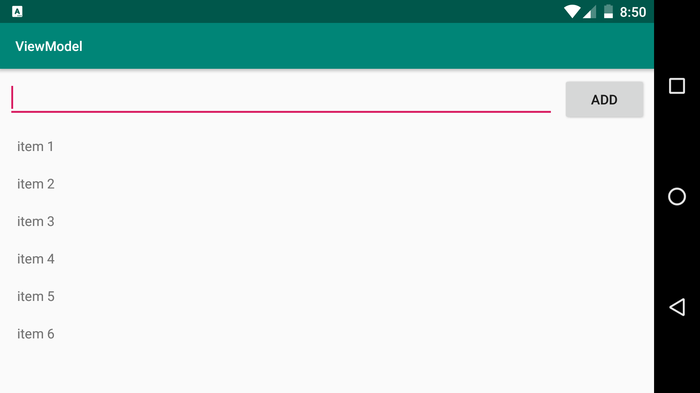
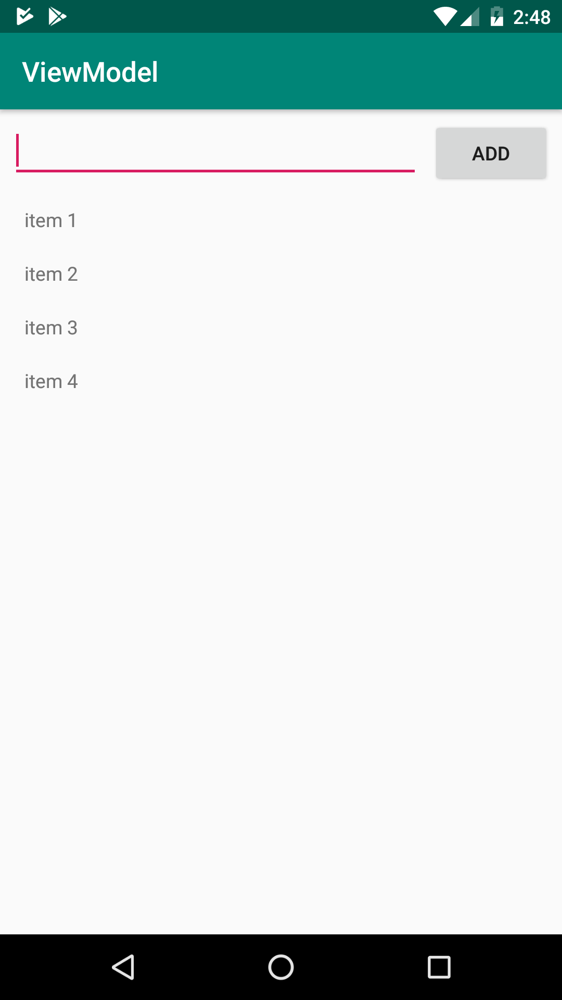

# kotlin-viewmodel
Basic samples about ViewModel component

  

# feedback

I appreciate any question or comment and could you give me a star if you consider useful. Also, you can put any issue at https://github.com/emedinaa/kotlin-viewmodel/issues
